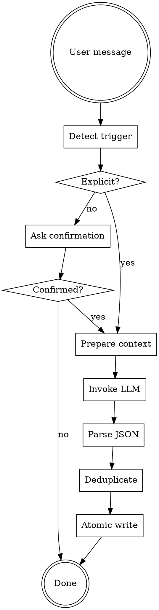

# Extraction Workflow

Detailed explanation of memory extraction process.

## Trigger Detection

### Step 1: Intent Recognition

When user sends a message, check for trigger phrases:

```javascript
function detectTrigger(message) {
  const explicit = [
    "更新memory", "更新记忆", "同步记忆",
    "加入记忆", "添加记忆", "保存到记忆",
    "记住这个", "记下来", "memory sync"
  ];
  
  const implicit = [
    "我喜欢", "我偏好", "以后", "下次",
    "经验是", "教训是", "避免", "下次注意"
  ];
  
  const project = [
    "项目进展", "当前状态", "下一步计划", "切换项目"
  ];
  
  for (const phrase of explicit) {
    if (message.includes(phrase)) return { type: 'extract', confirm: false };
  }
  
  for (const phrase of implicit) {
    if (message.includes(phrase)) return { type: 'extract', confirm: true };
  }
  
  for (const phrase of project) {
    if (message.includes(phrase)) return { type: 'project', confirm: true };
  }
  
  return { type: null };
}
```

### Step 2: Confirmation (if implicit)

For implicit triggers, ask user:

```
是否将此偏好加入记忆？(回复"是的"或"加入记忆"确认)
```

## Extraction Process

### Step 3: Prepare Context

Gather extraction context:

1. **Conversation history** - Recent user + AI messages
2. **Current memory state** - Load from memory.json
3. **Project context** - Current project info if applicable

### Step 4: Invoke LLM

Use extraction-prompt.md template:

```
输入:
- conversation_history: 最近对话内容
- current_memory: 当前记忆 JSON

输出:
- newPreferences: 新发现的偏好
- newExperiences: 经验总结
- projectUpdates: 项目更新
```

### Step 5: Parse Response

LLM returns JSON:

```json
{
  "newPreferences": [
    {
      "layer": "toolHabits",
      "content": "偏好使用 grep 搜索代码",
      "confidence": 0.85,
      "source": "explicit"
    }
  ],
  "newExperiences": [
    {
      "type": "lesson",
      "context": "调试 asyncio 问题",
      "insight": "嵌套 async 函数会导致问题",
      "derivedPreference": "遇到 asyncio 问题先检查嵌套",
      "confidence": 0.80
    }
  ],
  "projectUpdates": null
}
```

### Step 6: Deduplication

Check for duplicates before adding:

```javascript
function deduplicate(newEntry, existingEntries) {
  const newContent = newEntry.content.trim().toLowerCase();
  
  for (const existing of existingEntries) {
    const existingContent = existing.content.trim().toLowerCase();
    
    // Exact match
    if (newContent === existingContent) return true;
    
    // Contains match
    if (newContent.includes(existingContent) || 
        existingContent.includes(newContent)) return true;
    
    // Word overlap > 80%
    const overlap = calculateWordOverlap(newContent, existingContent);
    if (overlap > 0.8) return true;
  }
  
  return false;
}
```

### Step 7: Merge and Write

Atomic write to prevent corruption:

```javascript
function writeMemoryAtomic(filepath, data) {
  const tempPath = filepath + '.temp';
  
  // Write to temp file
  fs.writeFileSync(tempPath, JSON.stringify(data, null, 2));
  
  // Atomic rename
  fs.renameSync(tempPath, filepath);
}
```

## Full Flow



## Confidence Filtering

Only inject entries with confidence >= 0.7:

| Confidence | Treatment |
|------------|-----------|
| 0.9-1.0 | Always inject |
| 0.7-0.9 | Inject, may update later |
| 0.5-0.7 | Store but don't inject |
| Below 0.5 | Skip entirely |

## Error Handling

- **LLM parse failure**: Log error, ask user to retry
- **Write failure**: Restore from backup, notify user
- **Duplicate detected**: Skip silently or notify if explicit

## Best Practices

- Extract after significant work (complex task completion)
- Don't extract every message (avoid noise)
- Prefer user confirmation for uncertain entries
- Keep extraction prompts concise (token efficiency)