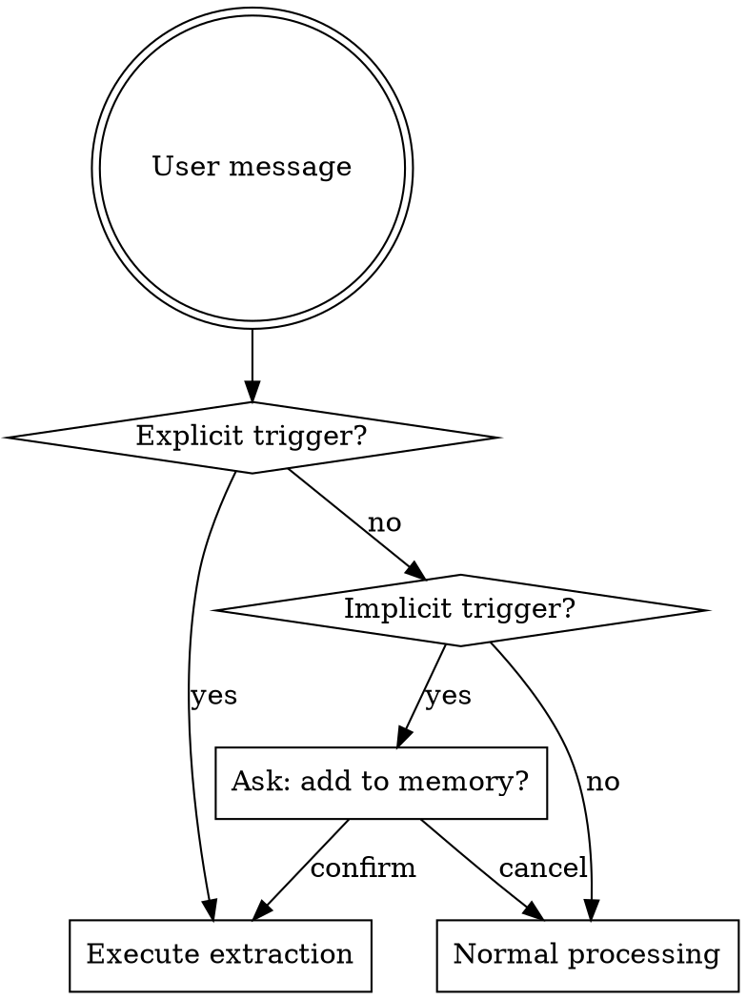

# Memory Skill

## Overview

Memory Skill enables persistent learning across conversations. It remembers user preferences, accumulated experiences, and project progress - making every conversation more personalized and efficient.

**Core principle:** Memory flows bidirectionally - inject at conversation start, extract when user triggers.

## Three-Layer Memory Architecture

```
┌─────────────────────────────────────────────────┐
│ Layer 1: User Preferences (Global)              │
│ ~/.config/opencode/memory.json                  │
│ - Tool habits: preferred tools, commands        │
│ - Thinking patterns: problem-solving approaches │
│ - Decision patterns: when to ask vs search      │
│ - Interaction style: verbosity, code style      │
└─────────────────────────────────────────────────┘
                    ↓ Updates from Layer 2
┌─────────────────────────────────────────────────┐
│ Layer 2: Experience Summary (Embedded in Global)│
│ - Success patterns: what worked                 │
│ - Failure lessons: what to avoid                │
│ - Derived preferences: improved habits          │
└─────────────────────────────────────────────────┘

┌─────────────────────────────────────────────────┐
│ Layer 3: Project Memory (Project-level)         │
│ 项目/.opencode/project-memory.json              │
│ - Project info: tech stack, structure, goals    │
│ - Progress: completed, current, next steps      │
│ - Issues: blockers, bugs, questions             │
│ - Decisions: key design choices and reasons     │
└─────────────────────────────────────────────────┘
```

## Intent Recognition

### Explicit Trigger Phrases (Direct Extraction)

When user message contains these, execute extraction immediately:

**Memory update:**
- "更新memory" / "更新记忆" / "同步记忆"
- "加入记忆" / "添加记忆" / "保存到记忆"
- "记住这个" / "记下来"

**Project related:**
- "切换项目" / "设置项目"

### Implicit Trigger Phrases (Confirm First)

When user message contains these patterns, ask confirmation:

**Preference patterns:**
- "我喜欢..." / "我偏好..." → "是否将此偏好加入记忆？"
- "以后..." / "下次..." → "是否将此习惯加入记忆？"

**Experience patterns:**
- "经验是..." / "教训是..." → "是否将此经验加入记忆？"
- "这个方法很好..." / "避免..." → "是否将此总结加入记忆？"
- "下次注意..." → "是否将此注意事项加入记忆？"

**Project patterns:**
- "项目进展..." / "当前状态..." → update project progress
- "下一步计划..." → update project next steps
- "项目背景是..." → update project info

### Recognition Flow



## Commands

| Command | Description |
|---------|-------------|
| `/memory` | Show all memory overview |
| `/memory global` | Show global preferences + experiences |
| `/memory project` | Show current project memory |
| `/memory add <content>` | Manually add memory entry |
| `/memory delete <id>` | Delete specified entry |
| `/memory search <keyword>` | Search memory content |
| `/memory sync` | Force extraction from current conversation |
| `/project <name>` | Set/switch current project |
| `/project status` | Show project detection status |

## Extraction Process

When triggered, execute this flow:

1. **Identify conversation context:**
   - Technical discussion → may produce experience
   - Project work → update project progress
   - Preference expression → update user preferences

2. **Invoke extraction prompt:**
   - Use extraction-prompt.md template
   - Input: conversation history + current memory state
   - Output: JSON update suggestions

3. **Merge updates:**
   - Deduplicate (content similarity check, trim whitespace)
   - Weight confidence (new experiences may have lower confidence)
   - Atomic write (temp file + rename)

4. **Project identification:**
   - Priority: git repo root as project ID
   - Fallback: mark as "global-only"
   - User can correct via `/project <name>`

## Injection Process

At conversation start, inject memory into system prompt:

```
<memory_context>
## User Preferences
[Top 5 high-confidence entries]

## Current Project
- Project: [name]
- Progress: [current work + next steps]
- Open Issues: [list]

## Relevant Experiences
[Entries matching current context]
</memory_context>
```

## Memory File Locations

| Platform | Global Memory | Project Memory |
|----------|---------------|----------------|
| OpenCode | `~/.config/opencode/memory.json` | `项目/.opencode/project-memory.json` |
| OpenClaw | `~/.config/openclaw/memory.json` | `项目/.openclaw/project-memory.json` |

## Common Mistakes

| Mistake | Fix |
|---------|-----|
| Not checking memory before task | Always read memory first |
| Duplicate entries | Trim whitespace, compare similarity |
| Low confidence noise | Filter by threshold (default 0.7) |
| Missing project detection | Use git root, fallback to manual |
| Forgetting to sync after big tasks | Prompt user after complex tasks |

## Key Reminders

- **Read before act:** Check memory at conversation start
- **Sync after success:** Suggest `/memory sync` after complex tasks
- **Project awareness:** Always identify current project
- **Confidence matters:** Only inject high-confidence entries
- **Deduplication:** Trim whitespace before comparing content